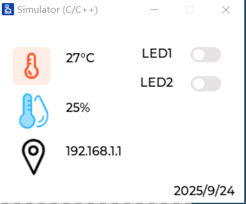
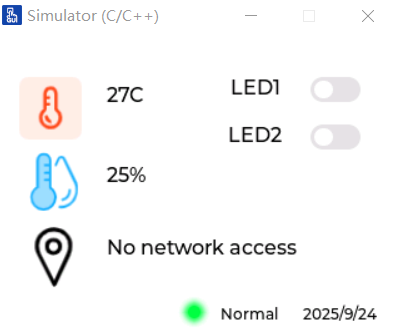

# STM32F4系列的工程文件

## STM32F407 Template

STM32F4系列标准库的工程模板


## STM32F407-LVGL-Template

STM32F4系列标准库和LVGL的模板，LVGL版本`8.3.10`，其中LVGL的界面设计使用`GUI GUIDER v1.9.1`，整体界面如下所示：



整体目录结构：

```
├─CORE								//cotex m4所需要的文件
├─FWLIB								//标准库外设文件     
├─HARDWARE							//自定义的外设文件
├─LVGL								//LVGL库
│      LVGL_SRC						//LVGL移植的目录
│      UI							//GUI GUIDER生成UI文件存放的目录
├─OBJ								//Keil构建项目输出目录
├─SYSTEM							//包括串口、延时函数以及IO定义，直接复制的正点原子的案例
└─User								//主函数所在目录
│      .cmsis						//VS Code插件EIDE生成的文件夹，可删除
│      .edie						//VS Code插件EIDE生成的文件夹，可删除
│      .vscode						//VS Code插件EIDE生成的文件夹，可删除
```

## STM32F407-LVGL-FreeRTOS

将LVGL与FreeRTOS综合起来，实现了一个小demo。创建了3个任务：

- LVGL任务：每5ms执行一次刷新任务
- 温湿度读取任务：读取温湿度（模拟出来的，没有使用硬件），并刷新LCD。10S执行一次
- 按键任务：按下按键刷新标签控件，按下KEY0显示"Normal"，按下KEY1显示"Abnormal"。50ms执行一次

注：重写了**Delay延时函数**，使用定时器实现延时函数，避免与FreeRTOS争夺Systick时钟，造成程序无法运行的情况。



FreeRTOS与LVGL加在一起比较耗资源，这个项目在EIDE下输出了以下信息：

```
Program Size: Code=182380 RO-data=74560 RW-data=788 ZI-data=81500  

Total RO  Size (Code + RO Data)               256940 ( 250.92kB)
Total RW  Size (RW Data + ZI Data)             82288 (  80.36kB)
Total ROM Size (Code + RO Data + RW Data)     257176 ( 251.15kB)

Total Memory Usage:

  RAM: [#############       ] 62.8%     80.4KB/128.0KB
  ROM: [##########          ] 49.1%     251.1KB/512.0KB
```

LVGL还可以进一步裁剪以减少SRAM和ROM
